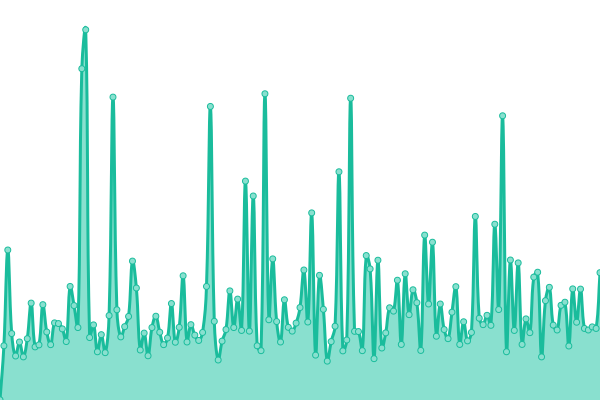

# [📈 Live Status](https://papies.github.io/upptime): <!--live status--> **🟩 All systems operational**

This repository contains the open-source uptime monitor and status page for [papies](https://papies.github.io/upptime), powered by [Upptime](https://github.com/upptime/upptime).

With [Upptime](https://upptime.js.org), you can get your own unlimited and free uptime monitor and status page, powered entirely by a GitHub repository. We use [Issues](https://github.com/papies/upptime/issues) as incident reports, [Actions](https://github.com/papies/upptime/actions) as uptime monitors, and [Pages](https://papies.github.io/upptime) for the status page.

<!--start: status pages-->
<!-- This summary is generated by Upptime (https://github.com/upptime/upptime) -->
<!-- Do not edit this manually, your changes will be overwritten -->
<!-- prettier-ignore -->
| URL | Status | History | Response Time | Uptime |
| --- | ------ | ------- | ------------- | ------ |
|  [Topfarmacia](https://www.topfarmacia.it) | 🟩 Up | [topfarmacia.yml](https://github.com/papies/upptime/commits/HEAD/history/topfarmacia.yml) | 

 990ms
     
 | 

<a href="https://papies.github.io/upptime/history/topfarmacia">100.00%</a>
    

|  [Feedaty widget](https://widget.feedaty.com/public/js/feedaty.js?merchant=10213975&style_ver=2021&data-sku=36263) | 🟩 Up | [feedaty-widget.yml](https://github.com/papies/upptime/commits/HEAD/history/feedaty-widget.yml) | 

 627ms
     
 | 

<a href="https://papies.github.io/upptime/history/feedaty-widget">99.89%</a>
    

<!--end: status pages-->

[**Visit our status website →**](https://papies.github.io/upptime)

## 📄 License

- Powered by: [Upptime](https://github.com/upptime/upptime)
- Code: [MIT](./LICENSE) © [papies](https://papies.github.io/upptime)
- Data in the `./history` directory: [Open Database License](https://opendatacommons.org/licenses/odbl/1-0/)
